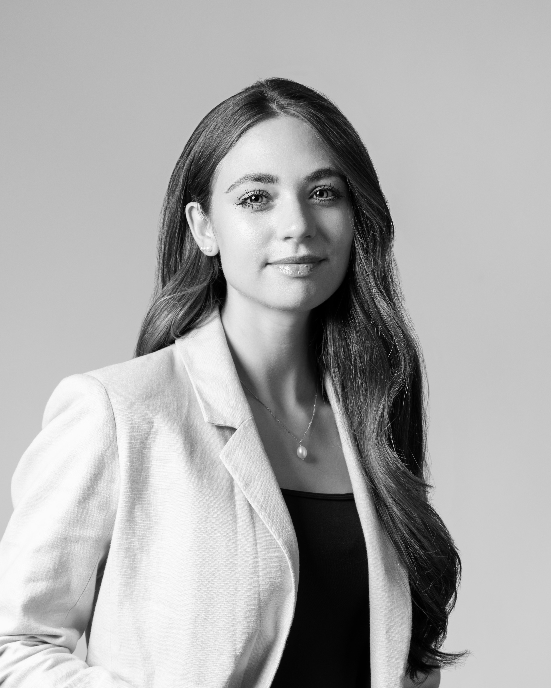
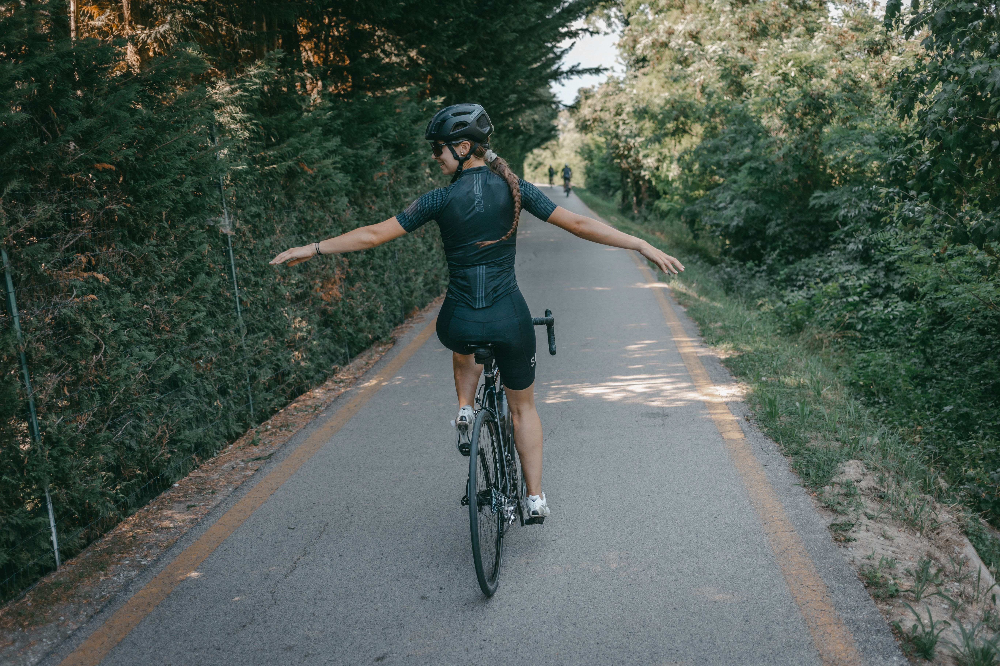
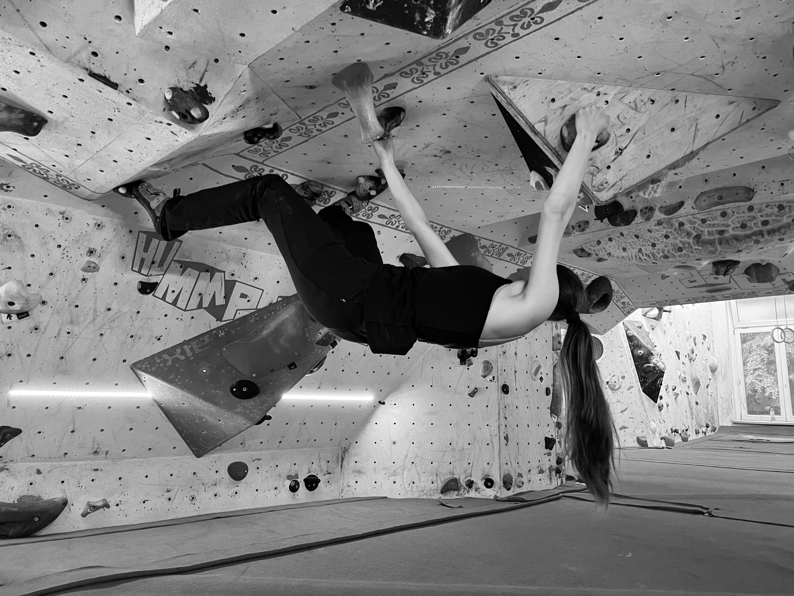
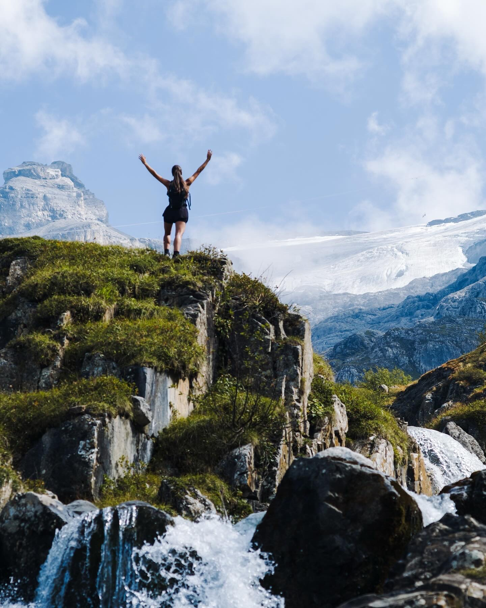
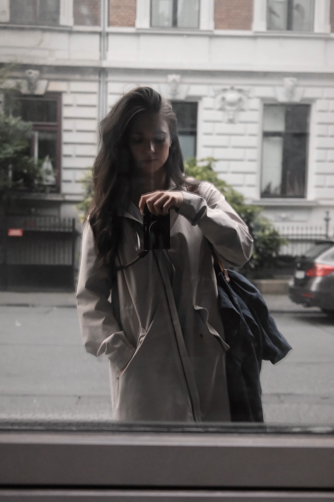
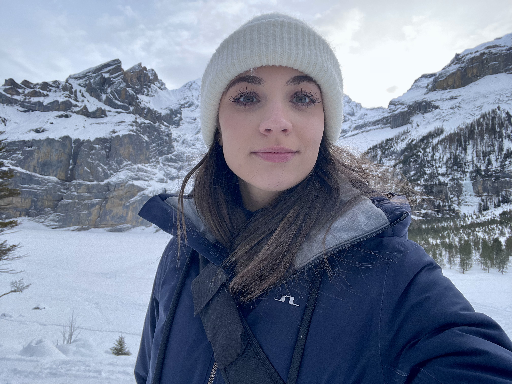
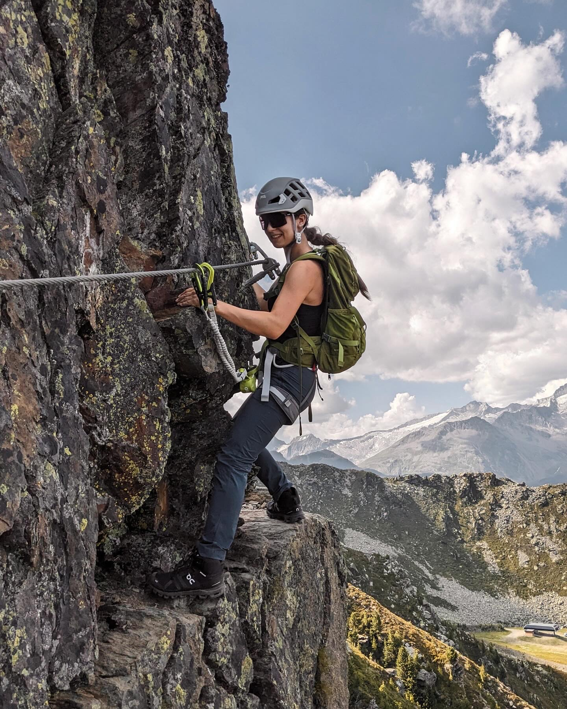

::: {.content-container}

## Here are (some of) my general research interests {.section-title}

::: {.about-grid}

::: {.about-text}

::: {.interest-list}
- Ibero-Romance pronominal syntax
- Differential object marking
- Second-language acquisition
- Statistical data modelling
- Natural language processing
- Forensic linguistics
- Experimental and corpus linguistics
- Psycholinguistics
- Syntax–semantics and syntax–discourse interfaces

:::

:::

::: {.about-image}
{fig-alt="Portrait of Philippa Adolf"}
:::

:::

## Here is (hopefully a current version of) my CV {.section-title}

[Download CV](material/cv_typst.pdf){.btn .btn-primary}

<iframe
  src="material/cv_typst.pdf"
  width="80%"
  height="800"
  title="Curriculum vitae of Philippa Adolf"
  class="cv-frame">
</iframe>

## Beyond research... {.section-title}

::: {.about-grid}

::: {.about-text}

Outside research, I’m usually happiest outdoors. I love inline skating, running, and cycling along the Danube as well as hiking in the Alps. When the weather turns colder, I switch to swimming, bouldering, and skiing. 

I'm also a huge fan of photography and usually take my camera wherever I go.
:::

::: {.photo-gallery}

:::

:::

:::